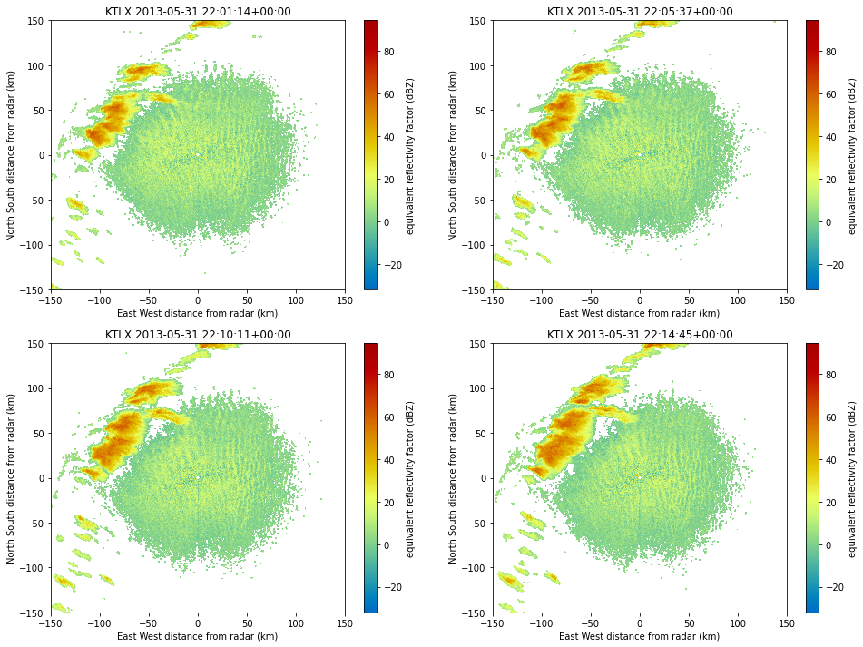

<h1>User Interface</h1>
<h3>Home screen</h3>

<li>User should be able to login to the application
    <ul>
        <li>
            Simple: User name/email, password
        </li>
        <li>
            Google sign in
        </li>        
    </ul>
</li>

<h3>View Radar information screen</h3>
<li>User should have three inputs, start date, end date and nearest airport radar CODE.    
</li>
<li>Based on user selected inputs, the closest radar data available in time for the particular airport should be displayed </li>
<li>All the events done by a particular user should be logged. </li>
<li>User should be able to logout from the application from this screen</li>
<h4>Sample output: </h4>
Station code: KTLX (Okalahoma), Start Date: 2013-5-31 17:00, End Date: 2013-5-31 19:00

(Only 4 outputs are displayed for simplicity)

<h3>Enhancements:</h3>
<ol>
    <li> Instead of displaying static images, try to show an interactive image. (Send co-ordinates from backend to leafJS and draw heatmap). (or) Use the images available to do simple animation</li>
    <li> User should be able to sign in with IU credentials.</li>
</ol>

